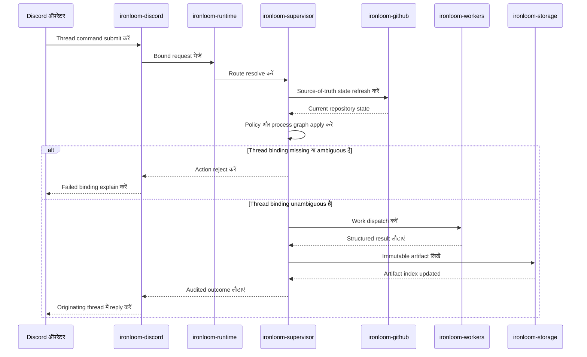

# ऑपरेटर वर्कफ्लो

Lifecycle-changing Discord actions exactly one persisted work item और thread से bound होने चाहिए। Missing या ambiguous thread context किसी worker के run होने से पहले fail closed करता है।

## Command Sequence

## Thread Binding

Ironloom Discord thread को operator context मानता है। Policy या worker dispatch चलने से पहले command को single work item में resolve होना चाहिए।

## GitHub State

Pull request, branch, check, review या merge decisions से पहले GitHub state refresh करना चाहिए। Cached state display और indexing support कर सकता है, लेकिन वह source of truth नहीं है।

## Artifacts

Supervisor immutable artifacts को `.ironloom` के अंतर्गत store करता है और उन्हें thread तथा work item से index करता है। Operator-facing responses को originating thread की ओर point करना चाहिए।
