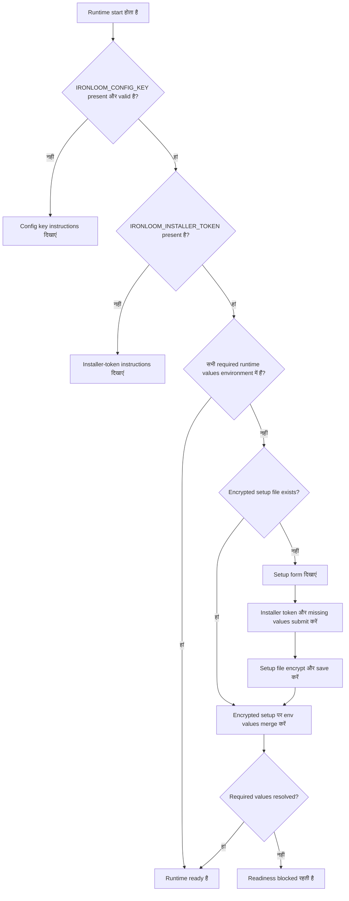

# आरंभिक सेटअप

Ironloom environment variables और encrypted local setup file से setup values accept करता है। Environment variables हमेशा precedence लेते हैं।

## Setup Resolution Flow



## Required Setup Variables

| Variable | Purpose |
| --- | --- |
| `IRONLOOM_CONFIG_KEY` | Base64-encoded 32-byte key जो local setup file encrypt और decrypt करने के लिए उपयोग होती है। |
| `IRONLOOM_INSTALLER_TOKEN` | Operator-generated token जो setup changes submit करने के लिए required है। |
| `IRONLOOM_STATE_ROOT` | Runtime state directory जिसमें encrypted setup state और `.ironloom` artifacts होते हैं। |

Key और installer token generate करें:

```sh
openssl rand -base64 32
```

## Runtime Variables

| Variable | Purpose |
| --- | --- |
| `IRONLOOM_PUBLIC_URL` | Public runtime base URL. |
| `IRONLOOM_DISCORD_TOKEN` | Discord token या secret reference. |
| `IRONLOOM_DISCORD_PUBLIC_KEY` | Discord public key या secret reference. |
| `IRONLOOM_GITHUB_TOKEN` | GitHub token या secret reference. |
| `IRONLOOM_SONARCLOUD_TOKEN` | SonarCloud token या secret reference. |
| `IRONLOOM_SONARCLOUD_ORGANIZATION` | SonarCloud organization. |
| `IRONLOOM_SONARCLOUD_PROJECT_KEY` | SonarCloud project key. |
| `IRONLOOM_OPENAI_API_KEY` | API-key authentication के लिए OpenAI API key. |
| `IRONLOOM_OPENAI_OAUTH_SESSION` | OAuth authentication के लिए OpenAI OAuth session reference. |

`IRONLOOM_OPENAI_API_KEY` या `IRONLOOM_OPENAI_OAUTH_SESSION` provide करें।

## Local Encrypted Setup

जब required runtime values environment में मौजूद नहीं हों, `/setup` installer token supplied होने के बाद उन्हें accept करता है। Ironloom encrypted setup state यहां लिखता है:

```text
${IRONLOOM_STATE_ROOT}/setup/config.enc.json
```

File AES-GCM से encrypted होती है और Unix systems पर owner-only permissions से लिखी जाती है।

## Precedence

Configuration resolution:

1. Environment variable.
2. `IRONLOOM_STATE_ROOT` के अंतर्गत encrypted setup file.
3. Missing configuration error.

इससे Kubernetes और Docker secrets encrypted setup file delete किए बिना local state override कर सकते हैं।
