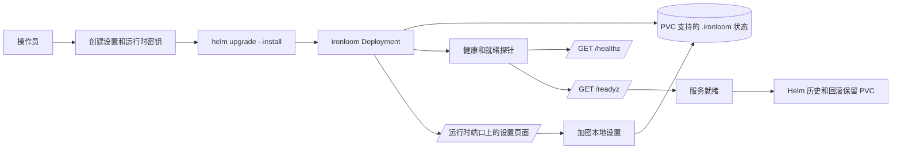

# 部署

除非注册表所有者发生变化，否则运行时镜像是 `ghcr.io/vannadii/ironloom`。Helm chart 部署 `ironloom` 二进制，并使用 PVC 支持的 `.ironloom` 状态、设置时加密的本地配置、Discord、GitHub、SonarCloud 和 OpenAI 凭据的可选密钥引用，以及健康和就绪探针。

使用 `deploy/helm/ironloom` 下的 Helm chart 进行 k3s 部署。

## 部署流程



## 运行时密钥

安装 chart 前，请在目标命名空间中创建设置密钥。`IRONLOOM_CONFIG_KEY` 必须是 Base64 编码的 32 字节密钥材料。`IRONLOOM_INSTALLER_TOKEN` 授权首次运行设置表单提交。

```sh
kubectl create namespace ironloom
kubectl -n ironloom create secret generic ironloom-setup \
  --from-literal=config-key="$(openssl rand -base64 32)" \
  --from-literal=installer-token="$(openssl rand -base64 32)"
```

运行时凭据可以通过 Kubernetes secrets、设置页面或两者同时提供。环境绑定的密钥优先于加密本地设置值。

```sh
kubectl -n ironloom create secret generic ironloom-discord \
  --from-literal=token="${IRONLOOM_DISCORD_TOKEN}" \
  --from-literal=public-key="${IRONLOOM_DISCORD_PUBLIC_KEY}"
kubectl -n ironloom create secret generic ironloom-github \
  --from-literal=token="${IRONLOOM_GITHUB_TOKEN}"
kubectl -n ironloom create secret generic ironloom-sonarcloud \
  --from-literal=token="${IRONLOOM_SONARCLOUD_TOKEN}"
kubectl -n ironloom create secret generic ironloom-openai \
  --from-literal=api-key="${IRONLOOM_OPENAI_API_KEY}"
```

对于 OpenAI 身份验证，请提供 `IRONLOOM_OPENAI_API_KEY` 或 `IRONLOOM_OPENAI_OAUTH_SESSION`。设置页面也支持两种模式。

## k3s 预演

更改集群前运行服务器端预演。

```sh
helm upgrade --install ironloom deploy/helm/ironloom \
  --namespace ironloom \
  --create-namespace \
  --dry-run=server
```

## 安装或升级

验证期间从本地 chart 安装，发布完成后也可以从已发布的 OCI chart 安装。

```sh
helm upgrade --install ironloom deploy/helm/ironloom \
  --namespace ironloom \
  --create-namespace \
  --set image.repository=ghcr.io/vannadii/ironloom \
  --set image.tag=0.1.0
```

```sh
helm upgrade --install ironloom oci://ghcr.io/vannadii/charts/ironloom \
  --namespace ironloom \
  --create-namespace \
  --version 0.1.0
```

## 冒烟检查

```sh
kubectl -n ironloom rollout status deployment/ironloom
kubectl -n ironloom port-forward service/ironloom 8080:8080
curl -fsS http://127.0.0.1:8080/healthz
curl -fsS http://127.0.0.1:8080/readyz
cargo test -p ironloom-runtime --test vertical_slice
```

## 回滚

除非操作员明确批准破坏性清理，否则保留 PVC。

```sh
helm -n ironloom history ironloom
helm -n ironloom rollback ironloom <revision>
kubectl -n ironloom rollout status deployment/ironloom
```

## 站点发布

`.github/workflows/docs-deploy.yml` 会在 `main` 上将 VitePress 站点发布到 GitHub Pages 的 `https://ironloom.dev`。
