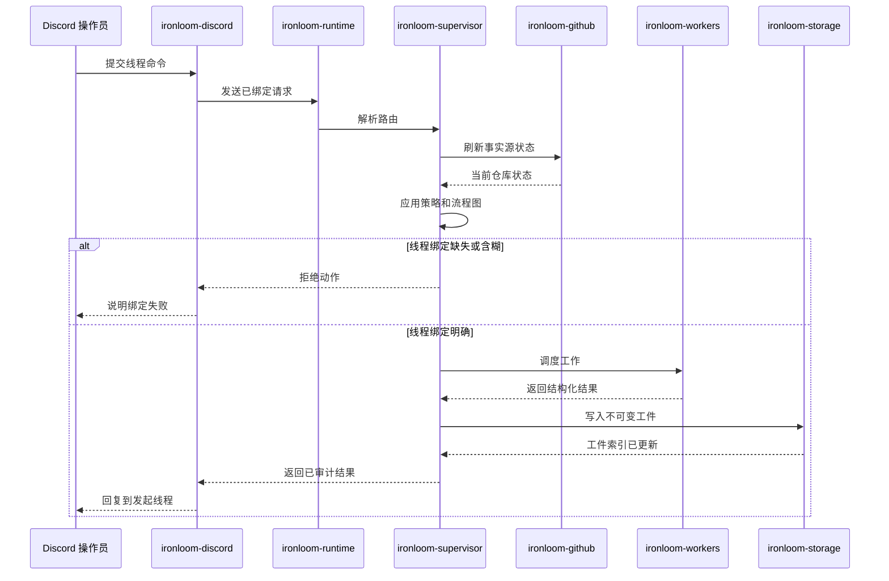

# 操作员工作流

会改变生命周期的 Discord 动作必须绑定到唯一持久化工作项和线程。在任何工作器运行之前，缺失或含糊的线程上下文都会失败关闭。

## 命令序列

## 线程绑定

Ironloom 将 Discord 线程视为操作员上下文。命令必须解析到单个工作项，策略或工作器调度才能运行。

## GitHub 状态

在拉取请求、分支、检查、审查或合并决策前，应刷新 GitHub 状态。缓存状态可以支持显示和索引，但它不是事实源。

## 工件

监督器将不可变工件存储在 `.ironloom` 下，并按线程和工作项建立索引。面向操作员的响应应指回发起线程。
