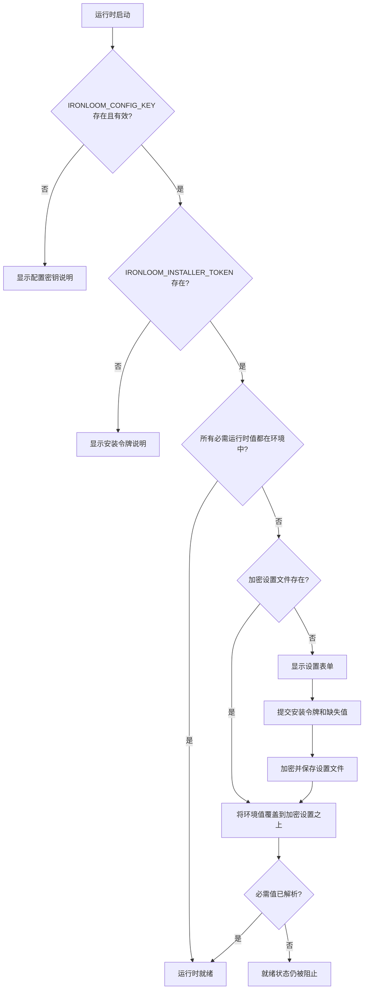

# 初始设置

Ironloom 接受来自环境变量和加密本地设置文件的设置值。环境变量始终优先。

## 设置解析流程



## 必需设置变量

| 变量 | 用途 |
| --- | --- |
| `IRONLOOM_CONFIG_KEY` | Base64 编码的 32 字节密钥，用于加密和解密本地设置文件。 |
| `IRONLOOM_INSTALLER_TOKEN` | 操作员生成的令牌，用于提交设置变更。 |
| `IRONLOOM_STATE_ROOT` | 运行时状态目录，包含加密设置状态和 `.ironloom` 工件。 |

使用以下命令生成密钥和安装令牌：

```sh
openssl rand -base64 32
```

## 运行时变量

| 变量 | 用途 |
| --- | --- |
| `IRONLOOM_PUBLIC_URL` | 公共运行时基础 URL。 |
| `IRONLOOM_DISCORD_APPLICATION_ID` | Discord 应用 ID，用于构建服务器授权 URL。 |
| `IRONLOOM_DISCORD_TOKEN` | Discord 令牌或密钥引用。 |
| `IRONLOOM_DISCORD_PUBLIC_KEY` | Discord 公钥或密钥引用。 |
| `IRONLOOM_GITHUB_TOKEN` | GitHub 令牌或密钥引用。 |
| `IRONLOOM_SONARCLOUD_TOKEN` | SonarCloud 令牌或密钥引用。 |
| `IRONLOOM_SONARCLOUD_ORGANIZATION` | SonarCloud 组织。 |
| `IRONLOOM_SONARCLOUD_PROJECT_KEY` | SonarCloud 项目键。 |
| `IRONLOOM_OPENAI_API_KEY` | API 密钥认证使用的 OpenAI API 密钥。 |
| `IRONLOOM_OPENAI_OAUTH_SESSION` | OAuth 认证使用的 OpenAI OAuth 会话引用。 |

请提供 `IRONLOOM_OPENAI_API_KEY` 或 `IRONLOOM_OPENAI_OAUTH_SESSION`。

## Discord 授权

在 Discord Developer Portal 中创建 Discord 应用，并将它的应用 ID 复制到 `IRONLOOM_DISCORD_APPLICATION_ID` 或 setup 页面。setup 页面可以生成带有 `bot` 和 `applications.commands` scope 的 Discord 授权 URL，让服务器管理员把 Ironloom 安装到目标服务器。

尽可能把 Discord bot 令牌和公钥放在环境变量或密钥绑定中。如果通过 `/setup` 输入，Ironloom 会把它们保存在加密的本地 setup 文件中。

## 本地加密设置

当必需运行时值不存在于环境中时，`/setup` 会在提供安装令牌后接受这些值。Ironloom 将加密设置状态写入：

```text
${IRONLOOM_STATE_ROOT}/setup/config.enc.json
```

该文件使用 AES-GCM 加密，并在 Unix 系统上以仅所有者可访问权限写入。

## 优先级

配置解析顺序为：

1. 环境变量。
2. `IRONLOOM_STATE_ROOT` 下的加密设置文件。
3. 缺少配置错误。

这使 Kubernetes 和 Docker 密钥可以覆盖本地状态，而不必删除加密设置文件。
